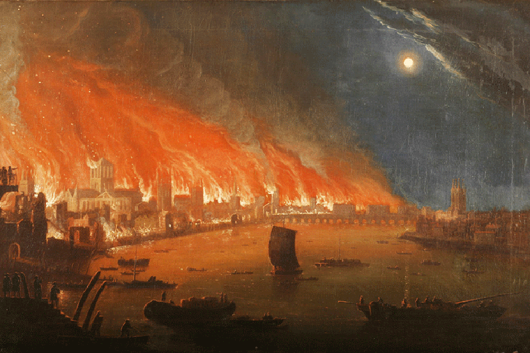

# Segunda Era

## Grande Guerra Vermelha

&#x20;Houve um tempo sombrio em que o outrora inabalável império foi tragado por uma espiral de caos. Catástrofes naturais sucessivas devastaram colheitas, cidades e rotas comerciais, enquanto a instabilidade política corroía lentamente os alicerces do poder imperial. O estopim dessa crise veio quando o imperador da época, já debilitado pela idade, não conseguiu gerar um herdeiro que fosse considerado digno de ocupar o trono, uma ausência que abriu espaço para a ambição desmedida florescer.

&#x20;Eclodiu então uma guerra civil brutal, marcada por batalhas sangrentas entre diversos senhores da guerra que disputavam o controle do império. Cada um carregava suas próprias motivações, que iam de ideais de renovação a meros desejos de conquista, mas todos acabaram contribuindo para o mesmo resultado: a devastação de todo o continente.

&#x20;Os registros históricos desse período são escassos e fragmentados; boa parte da memória do que ocorreu foi consumida pelo fogo, pela pilhagem e pelo esquecimento. A guerra não teve um desfecho claro ou tratado de paz: ela simplesmente se esgotou quando os recursos foram completamente exauridos e a população, exausta e faminta, não podia mais sustentar o conflito. Assim, o que restou foi apenas um cessar-fogo frágil, nascido não da reconciliação, mas da pura exaustão.

&#x20;Entre os poucos relatos preservados, destaca-se especialmente a queda da cidade de Tenzaku, a então capital do império. Outrora um centro grandioso de cultura, conhecimento e administração, Tenzaku foi quase completamente destruída, reduzida a ruínas e fragmentos de sua antiga glória. Hoje, ela ressurge como capital do Senhor Feudal do Fogo, mas carrega cicatrizes profundas de um passado que jamais foi totalmente reconstruído.

&#x20;A Grande Guerra Vermelha marca, portanto, uma fronteira histórica: próxima o bastante do auge do Alto Império para ser lembrada como o fim de uma era dourada, mas já distante o suficiente da atualidade para ter se tornado quase uma lenda. Seu legado, contudo, persiste nas ruínas que contam histórias silenciosas de destruição, ambição e queda.

<figure><figcaption></figcaption></figure>

***
